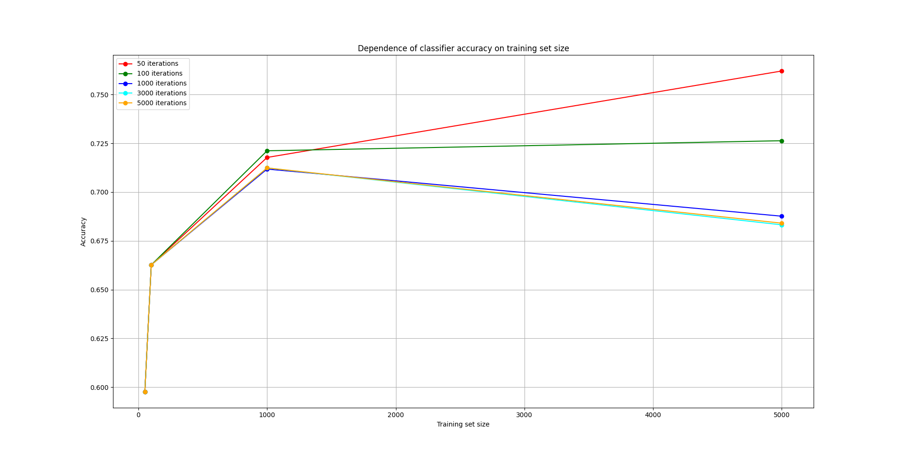
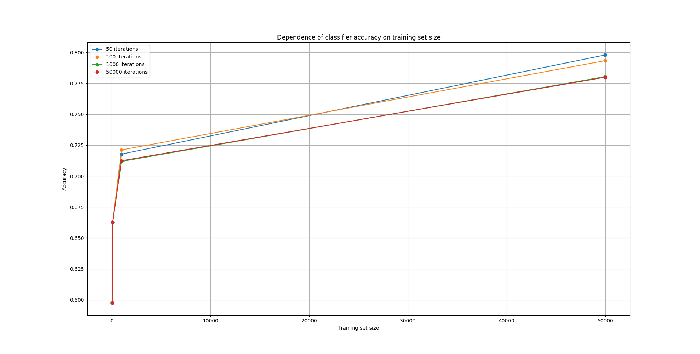

# Лабораторная работа №1. Основы машинного обучения
Герчик Артём Вадимович, ИиТП(ОБОИ) 1-й курс, группа 456241.
## Необходимые иструменты

- python 3.9.0
- виртуальная среда
- внешние библиотеки
- [большой набор данных](https://commondatastorage.googleapis.com/books1000/notMNIST_large.tar.gz)
- [малый набор данных](https://commondatastorage.googleapis.com/books1000/notMNIST_small.tar.gz)

```bash
# Установка виртуальной среды
python -m venv venv

# Активация виртуальной среды

# Windows
venv\Scripts\activate
# macOS and Linux
source venv/bin/activate

# Установка внешних зависимостей
pip install -r requirements.txt
```

## Использование

После запуска приложения необходимо указать путь до набора данных, а затем, если путь валиден, выбрать выполняемое задание, в соответствии с условием.

## Результаты




Как видно на графиках выше, при увеличении выборки с 5000 до 50000, точность значительно увеличивается и находится в одном диапазоне.
Однако, при увеличении количества итераций, точность начинает снижаться, связано это может быть с тем, что происходит переобучение модели.